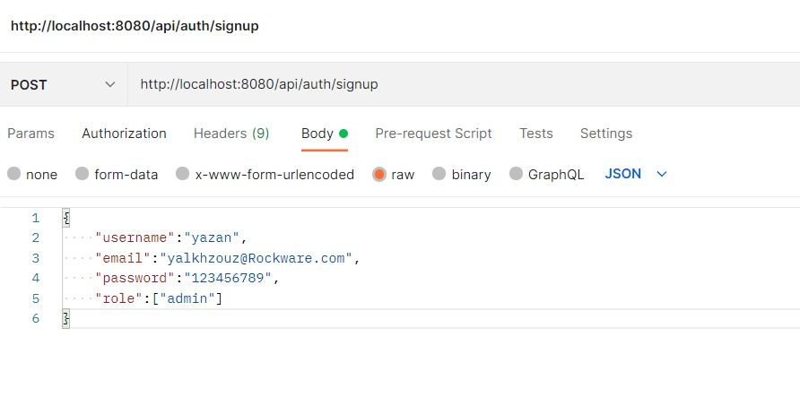
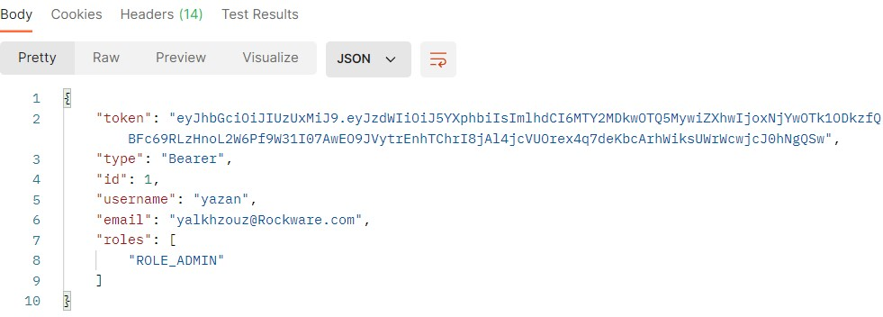
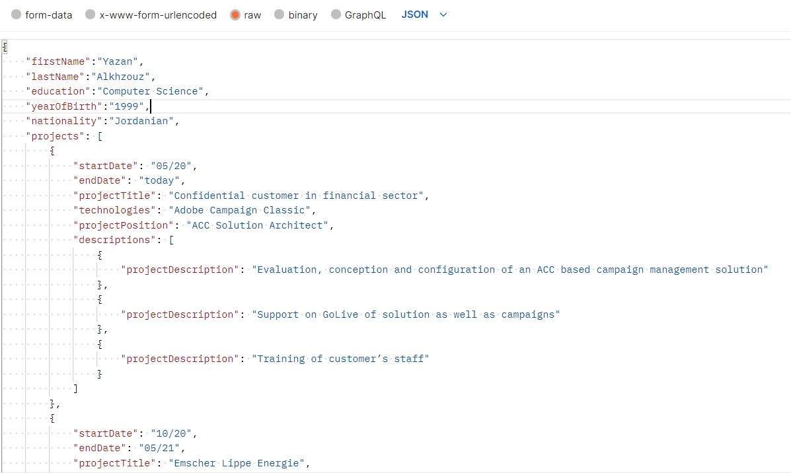
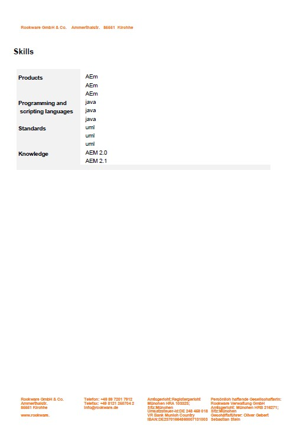
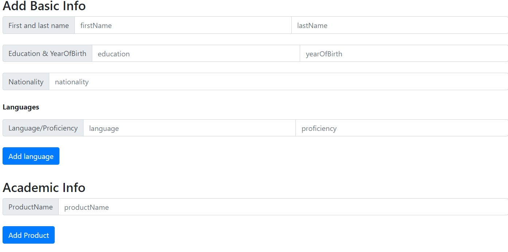
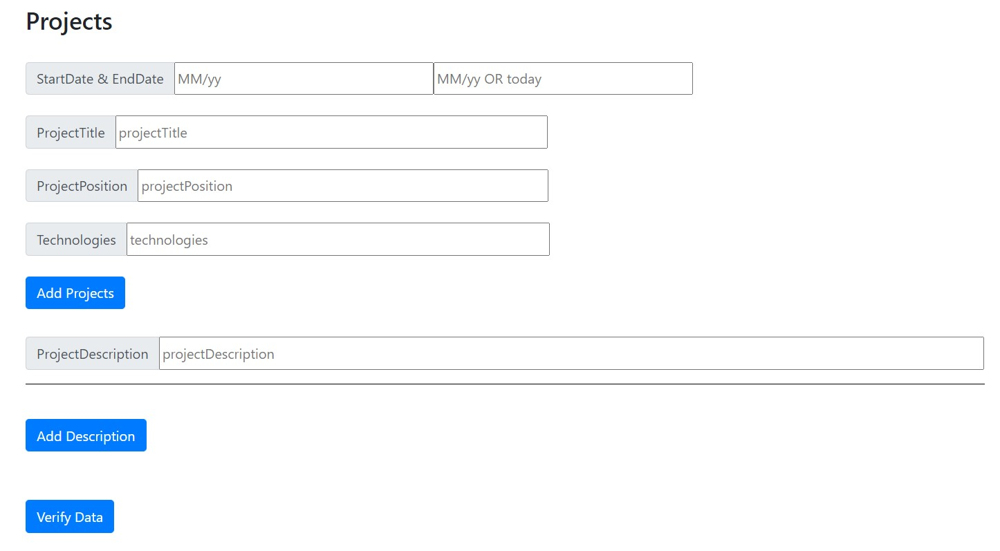

# Rockware Resume_Builder

This project consists of two applications: one is a Spring Boot Rest API called demo and another is a ReactJS application called Resume-Builder

a web application focusing on building/updating resumes for the employees and candidates based on our company template.

## Source Code
You can find the complete source code for this Project on [Github](https://github.com/rockwareGmbHCoKG/poc-client-server/tree/resumeBuilder) 

# Applications
- demo

Spring Boot Web Java backend application that exposes a REST API to create or manages the employees resumes. Its secured endpoints can just be accessed if an access token (JWT) is provided.

spring-backend stores its data in a h2 database.
## Technologies used in Backend
1- H2 Database (Free, also for commercial applications) <br/>
2- ItextPdf 5.0.6 (free in situations where you also distribute your software for free. As soon as you want to use iText in a closed source, proprietary environment, you have to pay for your use of iText.) <br/>
3- lombok (The standard license is free.paid for a professional or enterprise license) <br/>
4- Spring-data-jpa <br/>
5- JsonWebToken 0.9.1 (Free)

## spring-backend has the following endpoints:
### - http://localhost:8080/api/auth/signup --> (for creating an account with an admin role or with user role) 

by default the user will be registered with a normal user role unless specifing the ("role":["admin"])


### - http://localhost:8080/api/auth/signin --> signin into the registered account and the response contain a generated Jwt token for Authentication & Autharization  

 --> this token will be included in each request header to give you full authorization.


### - http://localhost:8080/api/userLogin/1/profile --> creating a userProfile to generate your resume.



### - http://localhost:8080/api/user/1 --> after creating a profile you can upload an image for the speciefied user by creating a new form-data specifing the key as file and then choose your desired image  

### - http://localhost:8080/api/user/1/resume --> you can now generate your resume by accessing to body section and choosing form-data 

### expected output 



# notes for backend 
1- to change the directory of generated resume simply go to resources file in your directory then go to application.properties then you can change the Directory, header company logo , the scale of person photo, and file name with or without the date of creation 


# Frontend

- Resume-Builder

A Frontend using React Hooks JWT Authentication with LocalStorage, React Router, Axios and Bootstrap.

## Technologies used in Frentend
1- React 17 <br/>
2- React-router-dom 6.3.0 <br/>
3- Axios 0.26.1 (free, but Axios Pro is paid)<br/>
4- React-validation 3.0.7 <br/>
5- Bootstrap 4.6.1 <br/>
6- Validator 13.7.0 <br/>
7- Material-ui (Most of MUI X's components are available for free, but more advanced features require a Pro or Premium commercial license.)

## - Components of Frontend

- The App component is a container with React Router (BrowserRouter). Basing on the state, the navbar can display its items.

- Login & Register pages have form for data submission (with support of react-validation library). They call methods from auth.service to make login/register request.

- auth.service methods use axios to make HTTP requests. Its also store or get JWT from Browser Local Storage inside these methods.

- Home page is public for all visitor.

- Profile page displays user information after the login action is successful.

- BoardAdmin page will be displayed by state user.roles. In this page, we use user.service to access protected resources from Web API to give access for editing Header and Footer. 

- user.service uses auth-header() helper function to add JWT to HTTP header. auth-header() returns an object containing the JWT of the currently logged in user from Local Storage.

## Description of these components and their functions

### - AuthServices/auth.service.js <br/>
This service uses Axios for HTTP requests and Local Storage for user information & JWT.
It provides following important functions:
- login( ) : POST {username, password} & save JWT to Local Storage.
- Logout( ) : remove JWT from Local Storage.
- register( ) : POST {username, email, password}.
- getCurrentUser( ) : get stored user information (including JWT).

### - AuthServices/auth.header.js <br/>
This service have methods for retrieving data from server. In the case we access protected resources, the HTTP request needs Authorization header.

function authHeader( ): checks Local Storage for user item. If there is a logged in user with Token (JWT), return HTTP Authorization header. Otherwise, return an empty object.

### - AuthServices/user.service.js <br/>

 service for accessing data with help of authHeader( ) function as a HTTP Header when requesting authorized resource. 

 ### - basicComponent/login.js <br/>

 This page has a Form with username & password.<br/>

– We’re gonna verify them as required field by calling Form validateAll( ) method to check validation functions in validations. Then CheckButton helps us to verify if the form validation is successful or not. So this button will not display on the form..<br/>

– If the verification is ok, we call AuthService.login( ) method, then direct user to Profile page using useNavigate( ) hook, or show message with response error.

 ### - basicComponent/register.js <br/>

 This page is similar to Login Page.

For Form Validation, there are some more details:

- username: required, between 3 and 20 characters <br/>

- email: required, email format<br/>

- password: required, between 6 and 40 characters <br/>

We’re gonna call AuthService.register() method and show response message (successful or error).

 ### - basicComponent/profile.js <br/>

 This page gets current User from Local Storage by calling AuthService.getCurrentUser() method and show user information. with two options to add your data to generate or to edit them if you already stored your data in the Database. 

 ### - backendCompnents/userProfile.js 

 this page is for generating your resume and it contains dynamic form fields for adding data as much as you want.
 
 
 
 
 

 ### - after adding your data you need to press the verify data button which is going to save your data in the backend and if there is any error an alert will pop out telling you to check your data.

### - after successfully validating your data you can now upload your photo to be saved in your resume document.

### - finally you can generate your Resume now and check your directory for the generated PDF (As mentioned above in the backend section where and how to change the place of the generated PDF file).

 ### - backendCompnents/update_data.js 
 this page will retrieve your data from the database and change any data you want then making the same procedure for generating your PDF.

 ### - backendComponents/users_Data.js
this is a protected page that will be only shown in the NavBar if the current user has an admin role, and you will be able to access of of the users data, edit their information, generate Resume's, and delete their accounts.

## - NavBar in App.js
The navbar dynamically changes by login status and current User’s roles.<br/>
- Home: always<br/>
- Login & Sign Up: if user hasn’t signed in yet<br/>
- Header/Footer & All Users : roles includes ROLE_ADMIN

## - Handle JWT Token expiration with response status common/EventBus.js
by set up a global event-driven system, or a PubSub system, which allows us to listen and dispatch events from independent components.

An Event Bus implements the PubSub pattern, events will be fired from other components so that they don’t have direct dependencies between each other. 

- on( ) method attachs an EventListener to the document object. The callback will be called when the event gets fired.<br/>
- dispatch( ) method fires an event using the CustomEvent API.<br/>
- remove( ) method removes the attached event from the document object.

we import EventBus in App component and listen to "logout" event, also we need to dispatch "logout" event in the components when getting Unauthorized response status(Protected Components).


# Project setup

### Frontend
```bash
npm install
```
### Run the application using:

```bash
cd .\resume\ 
npm run start
```
# Backend
### Run the project through the IDE (Intellij ultimate edition used here) 

or

run this command in the command line:
```bash
mvn spring-boot:run
```